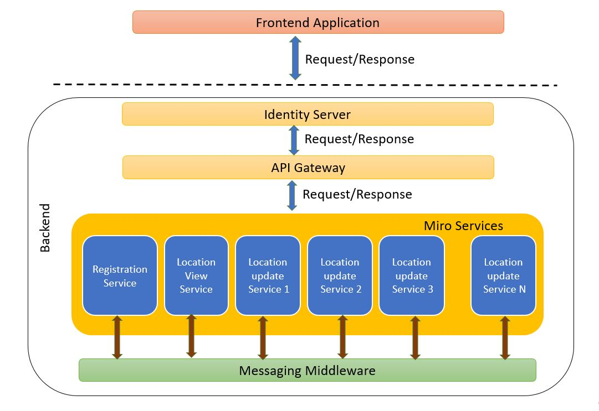

# Vehicle Tracking System

## Introduction

Vehicle Tracking is a project that registers vehicle through a GPS device mounted on them and allows the devices to send their location coordinate every 30 seconds.

Location data collected though the system helps administrators to view any vehicle's current location, its locality (with the help of Google reverse geocode API), and a vehicle's positions over a range of a given time.

Currently there are 10000 vehicles. Each vehicle will update its location every 30 seconds.
Administrators can query the current location of a vehicle, they can also see the positions of a vehicle within a time range.

## Nature of the problem

Registration happens only once for a given vehicle hence the load is on a system is negligible even if the number of vehicles increase in the future beyond the current 10,000.

Location update by each vehicle in every 30 second has high load on the system. If the location update requests are evenly distributed system must handle 333 requests/second. And if all vehicles send location update request at the same time system must handle 10000 requests/second. Both of these cases are extreme scenarios but possible to happen. The most likely scenario is in between those two extreme scenarios which is still heavy load on the system which needs to guarantee performance.

Location viewing whether current location of a vehicle or position of a vehicle over a range of time by Administrators happens a few times per day or so. Hence the load on system is not as high as location update as but significantly higher than registration component. 

### **The components can be summarized as follows**:


**Registration** :- Low write , medium read needs to be ptimized database for  read and write

**Location update** :- Heavy write operation needs to be scalable for heavy write operation as number of vehicle increases load increases 

**Location Viewing** :- Only read functionality needs ptimized database for  read query with indexing and query optimization 

## Architecture 	 	

The systems components need different performance and scalability levels. To allow each component to independently scale, deploy and maintain we need to separate them in to their own services by using the micro service architecture. On the current requirement of the system only the location update service needs to have multiple instances to enable it manage the high number of requests/second. The others are enough to have only one instance per service.

Due to the difference in the level of scalability needed the read operations and write operations of the location data separating them into their own service is considered.

Load balancing mechanism will be applied to distribute the location update requests among the multiple instances of the service. The location data from different instances will be aggregated by using a messaging middleware and put in to the Location view service.

We do not have to employ constant hashing function to always match a given vehicle location update request to the same instance since every location update has only device identification and location information and there is no value in tying a vehicle to service instance. What matters most in here is the evenly distribution of the location update requests among the service instances using round-robin scheme. This is done through the API gateway which also works as a load balancer.

All of the information from all instances of location update goes to location view service through the messaging middleware.



## Assumptions

> The GPS device embodied in a vehicle has capability to understand HTTP request and response to Authenticate and use JWT token

> The GPS device has unique ID to identify it in the system
	

## Data Model

The data model for all services is prepared using code first migration approach.

**Registration service** :- the registration service has only one table where authenticated devices register themselves
- The data model has *device id* field which is a primary key.Additionaly vehicle plate number and registration fields are added to help administrators link hevicle and device in the future.

**Location update service** :- Heavy write operation needs to be scalable for heavy write operation as number of vehicle increases load increases 
- This has location data model which captures device id,time stamp,latitude,longitude

**Location Viewing service** :- Only read functionality needs ptimized database for  read query with indexing and query optimization 
- This service aggregates all registered devices and their location updates.Hence it has a device info model and device location model which have one to many relationship

**Identity server** :- this is out of the box the open source identity server with minor change in database from sqlite to postgre.The opensource project has its own data model for users, their claims,login info, roles etc.Both administrators and device will use this identity server to authenticate themselves to access other services.
*API Gateway* :- does not have database 

## How to run Locally and Dependencies 

The architecture of the system is decoupled and they communicate using rabbitmq messaging.Messaging has advantages over HTTP for communicatioon because even if a consumer service is down the message can wait on the broker.

Since all projects are developed using .NET 5 they can be launched using the *dotnet run* command from inside their web project folders.

Install and run rabbitmq at port **5672**. MassTransit libray is used as a production grade wrraper on top of the native rabbitmq features.MassTransit requires to have a shared data model for both publisher and consumer hence the project **MessageModel** is developed for this purpose. 

All the services don't need to be exposed to external users, they can be protected behind network only the API gateway needs to access them.All User requests to services comes through the API gateway.'
### Steps and Dependency
	
*API Gateway*:- Has Ocelot dependency for developing loadbalancing and authentication system.This service does the authentication hence other services should not do authentication ,rather they should focus on their functionality.
> Run this service using *dotnet run* from inside the project folder .It is configured to run on port **6001**

*Identity server*:- This functions as token provider and validator.Uses postgre as database to store its data.
> First run migration an seed sample users with *dotnet run /seed* command.
> Run *dotnet run /device* to register sample device accounts 
> Both the above two commands are required only once, next time use only *dotnet run* to run it. It is configured to run on port 5001

*Registration service*:- This is where authenticated devices register themselves.Uses postgre as database to store its data.
> First run migration then *dotnet run * command. It is configured to run on port 7001
> When devices request to register the services checks if they already exist, if not it stores in its own database and publishes the data so that it can reach the location views service instance to store it in their own database

*Location view service*:- This is where authenticated admins request to get current device location, locality and device positions over time.Uses postgre as database to store its data.
> First run migration then *dotnet run * command. It is configured to run on port 8001
>The service consumes device registration ,and location update messages from the rabbitmq messaging service and stores in its own database.

*Location update service*:- This is where authenticated devices update their location every 30 seconds.This does not have database it directly published the location data to the messaging middleware which is then consumed by the location view service.
> It is configured to run on port 9001
> As the number of traffic for this service is high additional instance of the service can be deployed and they canstart taking requests by adding few lines of configuration in the **Ocelot** configuration file

*MessageModel*:- This a class library with no dependency.Its sole purpose is to serve as standard message exchange format which is required by MassTransit to exchange messages over rabbitmq.
> It does not need to be run, it is used by message publisher and consumer as dependency
> MassTransit creates the rabbitmq exchang,queue and topic from this model authomaticaly

## Scaling and Performance

When the need for more scaling arises for better performance,additional instances of the services can be deployed.The newly deployed instances should be configured on the API gateway configuration file.
> The configuration in Ocelot configuration file is few lines
```
	 {
	  "DownstreamPathTemplate": "/api/LocationUpdate",
	  "DownstreamScheme": "https",
	  "DownstreamHostAndPorts": [ //load balance across two instances
		{
		  "Host": "localhost",
		  "Port": 9001
		},
		{
		  "Host": "localhost",
		  "Port": 9002
		}
	  ],
	  "UpstreamPathTemplate": "/api/LocationUpdate",
	  "UpstreamHttpMethod": [ "Post" ],
	  "LoadBalancerOptions": {
		"Type": "RoundRobin"
	  },
	  "AuthenticationOptions": {
		"AuthenticationProviderKey": "TestKey",
		"AllowedScopes": [ "api1" ]
	  }
	},
```
> To even further enhance the performance caching can be added at the API Gateway

## Extending the system

New features can be added to the exisiting system in any of the services.The features can be small or big.Depending on the size feature they can be added by upgrading the exisiting data model by adding new fields or adding new models (tables).In either of them by running code first migration and developing the additional (if any) REST API the system can continue working without affecting existing service. 
If the new features are closely linked to each other and don't fit in the exisiting services they can be developed in to a separate service
